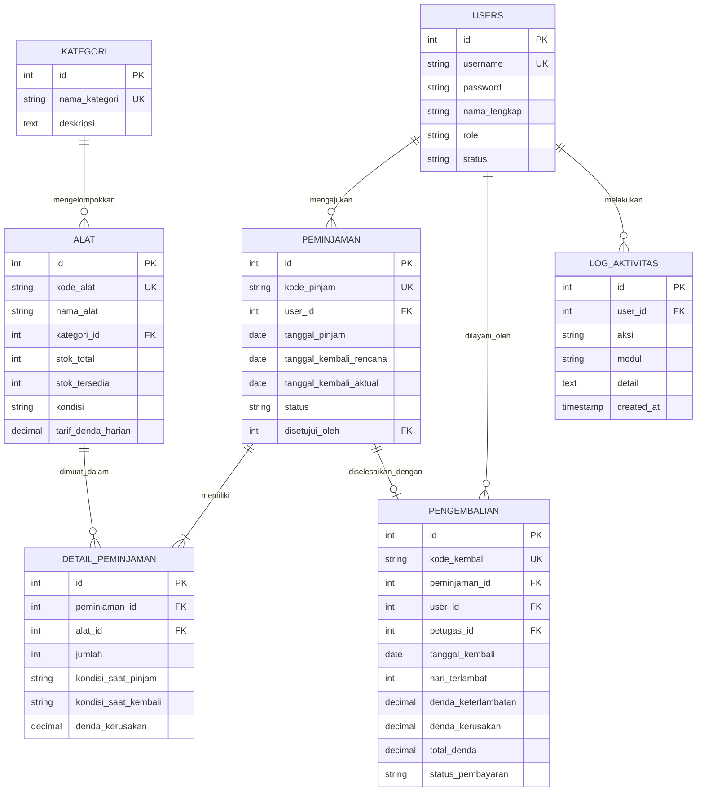

# PANDUAN LENGKAP PEMBUATAN APLIKASI PEMINJAMAN ALAT
### Uji Kompetensi Keahlian (UKK) Rekayasa Perangkat Lunak 2025/2026
**Kode Soal:** KM25.4.1.1  
**Bahasa Pemrograman:** Rust (Framework Axum + Tokio + SQLite/SQL)  
**Tahun Ajaran:** 2025/2026  

---

## DAFTAR ISI
1. [Analisis Kebutuhan & Spesifikasi Soal](#1-analisis-kebutuhan--spesifikasi-soal)
2. [Persiapan Lingkungan Pengembangan (Environment Setup)](#2-persiapan-lingkungan-pengembangan-environment-setup)
3. [Perancangan Basis Data (ERD, DDL, Triggers, Functions & Transaksi)](#3-perancangan-basis-data-erd-ddl-triggers-functions--transaksi)
4. [Struktur Direktori Proyek](#4-struktur-direktori-proyek)
5. [Konfigurasi Dependensi (Cargo.toml)](#5-konfigurasi-dependensi-cargotoml)
6. [Implementasi Backend Berbasis Rust](#6-implementasi-backend-berbasis-rust)
7. [Implementasi Antarmuka Pengguna (Frontend Modern SPA)](#7-implementasi-antarmuka-pengguna-frontend-modern-spa)
8. [Panduan Menjalankan & Menguji Aplikasi](#8-panduan-menjalankan--menguji-aplikasi)
9. [Penjelasan Logika Bisnis Kritis (Stok, Approval & Kalkulasi Denda)](#9-penjelasan-logika-bisnis-kritis-stok-approval--kalkulasi-denda)
10. [Dokumen Penilaian UKK (Cetak Laporan & Evaluasi)](#10-dokumen-penilaian-ukk-cetak-laporan--evaluasi)

---

## 1. Analisis Kebutuhan & Spesifikasi Soal

Pada soal UKK RPL Paket 1 (KM25.4.1.1), peserta ditugaskan membangun **Aplikasi Peminjaman Alat** dengan **3 Level Pengguna** (*Role-Based Access Control*):

| Fitur Aplikasi | Admin | Petugas | Peminjam |
| :--- | :---: | :---: | :---: |
| **Login & Logout** | ✅ | ✅ | ✅ |
| **CRUD User** (Kelola Akun) | ✅ | ❌ | ❌ |
| **CRUD Alat** (Inventaris Alat) | ✅ | ✅ | ❌ |
| **CRUD Kategori** (Kategori Alat) | ✅ | ✅ | ❌ |
| **CRUD Data Peminjaman** | ✅ | ❌ | ❌ |
| **CRUD Pengembalian** | ✅ | ❌ | ❌ |
| **Log Aktifitas** (Audit Trail) | ✅ | ❌ | ❌ |
| **Menyetujui Peminjaman** (Approval) | ✅ | ✅ | ❌ |
| **Memantau Pengembalian** (Cek Alat & Denda) | ✅ | ✅ | ❌ |
| **Mencetak Laporan** (Filter & Print) | ✅ | ✅ | ❌ |
| **Melihat Daftar Alat** (Katalog Alat) | ✅ | ✅ | ✅ |
| **Mengajukan Peminjaman** | ❌ | ❌ | ✅ |
| **Mengembalikan Alat** (Ajukan Balik) | ❌ | ❌ | ✅ |

---

## 2. Persiapan Lingkungan Pengembangan (Environment Setup)

### A. Mengapa Memilih Rust untuk UKK RPL?
1. **Performa Sangat Tinggi & Efisiensi Memori:** Rust dikompilasi langsung ke *machine code* tanpa *garbage collector*, menjamin query dan pemrosesan halaman memuat secepat kilat (*sub-millisecond latency*).
2. **Keamanan Tipe Data & Zero-Bug Memory:** Kompiler Rust (*Borrow Checker*) secara otomatis mencegah bug memori, *null pointer exceptions*, dan *data race conditions*.
3. **Mandiri (Single Executable):** Aplikasi web Rust dapat berjalan sebagai satu berkas biner mandiri yang sangat mudah didistribusikan ke server penguji UKK.

### B. Langkah Instalasi Toolchain Rust
1. Unduh penginstal resmi Rust dari [https://rustup.rs/](https://rustup.rs/) atau via Windows Terminal:
   ```powershell
   winget install Rustlang.Rustup
   ```
2. Jalankan konfigurasi toolchain stabil:
   ```powershell
   rustup default stable
   ```
3. Verifikasi instalasi:
   ```powershell
   rustc --version
   cargo --version
   ```

---

## 3. Perancangan Basis Data (ERD, DDL, Triggers, Functions & Transaksi)

### A. Entity Relationship Diagram (ERD)


### B. Fitur Basis Data Wajib Sesuai Soal UKK
1. **Relasi Foreign Key:** Memastikan integritas referensial antar tabel (misal: alat tidak dapat dihapus jika sedang ada peminjaman aktif).
2. **Function Perhitungan Denda:** Menghitung selisih hari keterlambatan dikalikan tarif denda harian (`fn_hitung_denda_keterlambatan`).
3. **Stored Procedure Peminjaman & Pengembalian:** Mengemas validasi stok, pemotongan kuantitas, dan mutasi status dalam transaksi ACID.
4. **Trigger Otomatis:**
   - Pemotongan `stok_tersedia` secara otomatis saat status peminjaman disetujui (`trg_kurangi_stok_saat_disetujui`).
   - Pemulihan stok saat pengembalian diverifikasi.
   - Pencatatan otomatis ke tabel `log_aktivitas`.
5. **Perintah Transaksi (COMMIT & ROLLBACK):**
   - Transaksi dibatalkan (`ROLLBACK`) jika stok tidak mencukupi atau alat tidak ditemukan.
   - Transaksi disimpan permanen (`COMMIT`) jika semua validasi terpenuhi.

> File SQL lengkap dapat ditemukan pada berkas `database.sql` di direktori proyek.

---

## 4. Struktur Direktori Proyek

```
ukk1/
├── Cargo.toml                    # Konfigurasi dependensi Rust
├── database.sql                  # Berkas SQL DDL, DML, Triggers & Procedures
├── CARA_PEMBUATAN.md             # Panduan langkah demi langkah ini
├── DOKUMENTASI_MODUL.md          # Dokumen IPO (Input-Process-Output) per modul
├── FLOWCHART_DAN_PSEUDOCODE.md   # Diagram alur & pseudocode algoritma
├── SKENARIO_PENGUJIAN.md         # Tabel kasus uji pengujian sistem (Test Cases)
├── LAPORAN_EVALUASI.md           # Laporan evaluasi hasil implementasi
├── data/
│   └── database.json             # File persistensi basis data otomatis
├── src/
│   ├── main.rs                   # Entry point server, konfigurasi routing Axum
│   ├── db.rs                     # State basis data & simulasi transaksi ACID
│   ├── models.rs                 # Struct data model & request/response DTOs
│   ├── auth.rs                   # Middleware otentikasi & RBAC
│   └── handlers/
│       ├── mod.rs                # Module exporter
│       ├── auth_handler.rs       # Endpoint login, logout, get current user
│       ├── user_handler.rs       # CRUD Pengguna (Khusus Admin)
│       ├── kategori_handler.rs   # CRUD Kategori Alat (Admin & Petugas)
│       ├── alat_handler.rs       # CRUD Alat & Katalog (Semua level)
│       ├── pinjam_handler.rs     # Pengajuan pinjam & Approval Petugas
│       ├── kembali_handler.rs    # Pengembalian, kalkulasi denda & stok
│       ├── log_handler.rs        # Audit log aktivitas (Khusus Admin)
│       └── report_handler.rs     # Data statistik dashboard & cetak laporan
└── static/
    ├── index.html                # Antarmuka SPA Modern (Responsive, Fast)
    ├── css/
    │   └── style.css             # Desain styling modern, glassmorphism, print CSS
    └── js/
        └── app.js                # Logika front-end interaktif & API client
```

---

## 5. Konfigurasi Dependensi (Cargo.toml)

Berkas `Cargo.toml` mendefinisikan pustaka Rust murni yang digunakan:

```toml
[package]
name = "aplikasi_peminjaman_alat"
version = "1.0.0"
edition = "2021"
authors = ["Siswa RPL SMK - UKK 2025/2026"]
description = "Aplikasi Peminjaman Alat UKK RPL 2025/2026 berbasis Rust"

[dependencies]
tokio = { version = "1.38", features = ["full"] }
axum = "0.7.5"
tower-http = { version = "0.5.2", features = ["cors", "fs", "trace"] }
serde = { version = "1.0", features = ["derive"] }
serde_json = "1.0"
chrono = { version = "0.4", features = ["serde"] }
uuid = { version = "1.8", features = ["v4", "fast-rng"] }
```

---

## 6. Implementasi Backend Berbasis Rust

### A. Model Data & DTOs (`src/models.rs`)
Mendefinisikan entitas peran pengguna (`Admin`, `Petugas`, `Peminjam`), model `User`, `Kategori`, `Alat`, `Peminjaman`, `Pengembalian`, dan `LogAktivitas` dengan macro `#[derive(Serialize, Deserialize)]` agar dapat dikonversi ke JSON secara efisien.

### B. State Basis Data & ACID Storage (`src/db.rs`)
Menggunakan `Arc<RwLock<DatabaseState>>` yang thread-safe untuk mengelola data in-memory berkecepatan tinggi dengan auto-save ke `data/database.json`. Jika berkas belum ada, sistem secara otomatis mengisi *seed data* lengkap dengan akun pengujian.

### C. Otentikasi & RBAC (`src/auth.rs`)
Fungsi `extract_auth_user()` mengekstrak *bearer token* dari *header request*, memverifikasi status keaktifan akun, dan `require_role()` memblokir akses pengguna yang tidak memiliki privilege (HTTP 403 Forbidden).

### D. Router & Server HTTP (`src/main.rs`)
Menggunakan Axum untuk mengikat rute REST API dan menyajikan folder `static/` secara otomatis:
- `POST /api/auth/login`
- `GET|POST|PUT|DELETE /api/users` (Admin)
- `GET|POST|PUT|DELETE /api/alat` (Admin & Petugas)
- `GET|POST|PUT|DELETE /api/kategori` (Admin & Petugas)
- `POST /api/peminjaman` (Peminjam mengajukan)
- `POST /api/peminjaman/:id/approve` (Petugas/Admin menyetujui)
- `POST /api/pengembalian/proses` (Petugas/Admin memproses pengembalian & hitung denda)
- `GET /api/logs` (Admin memantau jejak audit)
- `GET /api/reports` (Cetak rekapitulasi laporan)

---

## 7. Implementasi Antarmuka Pengguna (Frontend Modern SPA)

### A. HTML Responsif (`static/index.html`)
Menyediakan Single Page Application (SPA) tanpa perlu reload halaman:
- **Akun Uji Instan (Quick Switch):** Mempermudah penguji/guru UKK untuk berganti peran antara Admin, Petugas, dan Peminjam hanya dengan 1 klik.
- **Katalog Alat Visual:** Menampilkan ketersediaan stok, lokasi, tarif denda, dan badge kondisi.
- **Live Fine Preview:** Menghitung hari keterlambatan dan rincian denda secara langsung saat tanggal atau kondisi alat dipilih.
- **Format Cetak Laporan Formal:** Dilengkapi Kop Surat Sekolah resmi dan kolom tanda tangan penguji.

### B. Styling CSS Modern (`static/css/style.css`)
- Menggunakan palet warna terkurasi (*Deep Slate*, *Indigo*, *Emerald*, *Rose*).
- Dukungan Tema Gelap & Terang (*Dark/Light Mode*).
- Aturan `@media print` untuk menghasilkan cetakan dokumen yang bersih dan rapi.

### C. Logika Klien Interaktif (`static/js/app.js`)
Mengelola *state* sesi, pemanggilan API secara asinkron (*fetch API*), validasi masukan formulir, dan notifikasi *toast*.

---

## 8. Panduan Menjalankan & Menguji Aplikasi

### A. Menjalankan Aplikasi
Buka PowerShell pada direktori proyek (`d:/belajar ukk rust/ukk1`), lalu jalankan:
```powershell
cargo run
```
Aplikasi akan aktif pada alamat:
👉 **`http://localhost:3000`**

### B. Akun Bawaan untuk Pengujian UKK
Gunakan tombol **Akun Uji** di sudut kanan atas halaman web, atau masuk secara manual dengan kredensial:

| Peran (Role) | Username | Password | Deskripsi Tugas |
| :--- | :--- | :--- | :--- |
| **Admin** | `admin` | `admin123` | Akses penuh: kelola user, alat, kategori, log aktivitas, cetak laporan |
| **Petugas** | `petugas` | `petugas123` | Kelola alat & kategori, approval peminjaman, proses pengembalian & denda, cetak laporan |
| **Peminjam** | `peminjam` | `peminjam123` | Siswa: lihat katalog alat, ajukan pinjam alat, pantau riwayat pinjam |

---

## 9. Penjelasan Logika Bisnis Kritis (Stok, Approval & Kalkulasi Denda)

### 1. Validasi & Pemotongan Stok
1. Siswa mengajukan pinjaman: sistem memastikan `jumlah <= stok_tersedia`. Status awal adalah `menunggu`.
2. Saat Petugas menyetujui peminjaman: sistem memeriksa ulang stok fisik terkini dan langsung memotong `stok_tersedia = stok_tersedia - jumlah`.
3. Jika ditolak, stok tidak berubah dan alasan penolakan dicatat.

### 2. Formula Perhitungan Denda Pengembalian
$$Hari\,Terlambat = \max(0,\,Tanggal\,Kembali - Tanggal\,Rencana)$$
$$Denda\,Keterlambatan = Hari\,Terlambat \times Tarif\,Denda\,Harian$$
$$Total\,Denda = Denda\,Keterlambatan + Denda\,Kerusakan$$

**Ketentuan Biaya Kerusakan Fisik:**
- **Kondisi Baik:** Rp 0
- **Rusak Ringan:** Rp 25.000
- **Rusak Berat:** Rp 100.000 (atau ganti rugi fisik)

### 3. Pemulihan Stok Alat
Saat pengembalian alat dikonfirmasi oleh Petugas/Admin, kuantitas stok alat secara otomatis dipulihkan kembali ke inventaris:
$$stok\_tersedia = \min(stok\_total,\,stok\_tersedia + jumlah)$$

---

## 10. Dokumen Penilaian UKK (Cetak Laporan & Evaluasi)

1. Buka menu **Cetak Laporan UKK** saat login sebagai Petugas atau Admin.
2. Tentukan rentang tanggal periode (contoh: `2026-09-01` s/d `2026-09-30`).
3. Klik tombol **Cetak Dokumen / Print PDF** atau tekan `Ctrl + P`.
4. Sistem secara otomatis menampilkan pratinjau cetak resmi dengan Kop Laboratorium Komputer/RPL dan lembar tanda tangan penguji.
