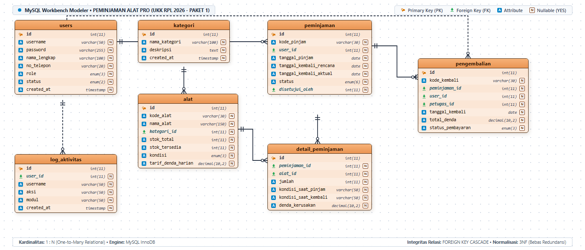
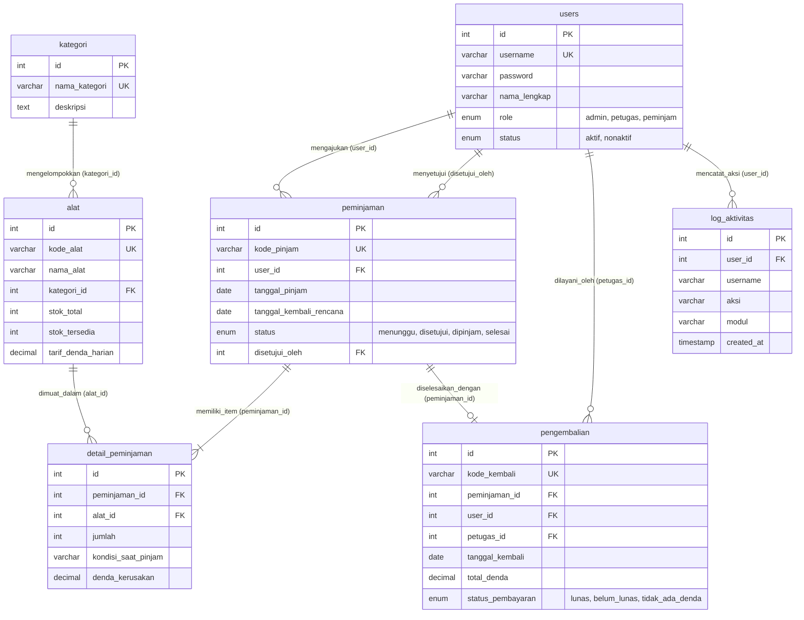

# Panduan & Dokumentasi ERD (Entity Relationship Diagram)
## Sistem Manajemen Peminjaman Alat (UKK RPL 2025/2026 - Paket 1)
**Gaya Pemodelan:** MySQL Workbench Modeler Standard (Crow's Foot Notation)  
**Tingkat Normalisasi:** 3NF (Third Normal Form - Bebas Redundansi)  
**Engine Basis Data:** MySQL InnoDB / SQLite3 Relational Engine  

---

## 1. Visualisasi Diagram ERD (MySQL Workbench Modeler)

Berikut adalah diagram fisik skema basis data `db_peminjaman_alat` yang dimodelkan persis dengan standar visual MySQL Workbench Modeler:

> **File Sumber Kanvas & Gambar:**
> - Berkas HTML Interaktif: [assets/erd_workbench.html](file:///d:/belajar%20ukk%20rust/ukk1/assets/erd_workbench.html)
> - Berkas Gambar Resolusi Tinggi (1400 × 600 px): [assets/erd_diagram.png](file:///d:/belajar%20ukk%20rust/ukk1/assets/erd_diagram.png)
> - Slide Presentasi Sidang UKK: [Presentasi_Peminjaman_Alat_UKK1.pptx](file:///d:/belajar%20ukk%20rust/ukk1/Presentasi_Peminjaman_Alat_UKK1.pptx)

---

## 2. Diagram Konseptual Relasi (Mermaid Notation)

---

## 3. Kamus Data Teknis (7 Tabel Ternormalisasi)

### A. Tabel `users` (Master Data Pengguna)
Menyimpan akun pengguna sistem dengan kontrol akses berbasis peran (*Role-Based Access Control*).

| Kolom | Tipe Data | Nullable | Keterangan & Batasan |
| :--- | :--- | :---: | :--- |
| `id` | `INT(11)` | **NO** | **Primary Key**, Auto Increment |
| `username` | `VARCHAR(50)` | **NO** | Unique identifier login pengguna |
| `password` | `VARCHAR(255)` | **NO** | Hash sandi Bcrypt/Argon2 aman |
| `nama_lengkap` | `VARCHAR(100)` | **NO** | Nama lengkap personil |
| `no_telepon` | `VARCHAR(20)` | YES | Nomor kontak WhatsApp/seluler |
| `alamat` | `TEXT` | YES | Alamat domisili |
| `role` | `ENUM` | **NO** | Nilai: `'admin'`, `'petugas'`, `'peminjam'` |
| `status` | `ENUM` | **NO** | Nilai: `'aktif'`, `'nonaktif'` |
| `created_at` | `TIMESTAMP` | **NO** | Default: `CURRENT_TIMESTAMP` |

### B. Tabel `kategori` (Master Klasifikasi Alat)
| Kolom | Tipe Data | Nullable | Keterangan & Batasan |
| :--- | :--- | :---: | :--- |
| `id` | `INT(11)` | **NO** | **Primary Key**, Auto Increment |
| `nama_kategori` | `VARCHAR(100)` | **NO** | Unique, contoh: Alat Ukur, Kelistrikan |
| `deskripsi` | `TEXT` | YES | Penjelasan cakupan jenis alat |
| `created_at` | `TIMESTAMP` | **NO** | Waktu pencatatan |

### C. Tabel `alat` (Master Inventaris Barang)
| Kolom | Tipe Data | Nullable | Keterangan & Batasan |
| :--- | :--- | :---: | :--- |
| `id` | `INT(11)` | **NO** | **Primary Key**, Auto Increment |
| `kode_alat` | `VARCHAR(30)` | **NO** | Unique, format: `ALT-001` |
| `nama_alat` | `VARCHAR(150)` | **NO** | Nama resmi alat praktikum |
| `kategori_id` | `INT(11)` | **NO** | **Foreign Key** `kategori(id)` |
| `stok_total` | `INT(11)` | **NO** | Jumlah total fisik alat di bengkel |
| `stok_tersedia` | `INT(11)` | **NO** | Stok yang sedang tidak dipinjam |
| `kondisi` | `ENUM` | **NO** | `'baik'`, `'rusak_ringan'`, `'rusak_berat'` |
| `lokasi` | `VARCHAR(100)` | YES | Posisi rak/lemari penyimpanan |
| `spesifikasi` | `TEXT` | YES | Rincian teknis/kapasitas alat |
| `tarif_denda_harian` | `DECIMAL(10,2)` | **NO** | Tarif denda per hari jika terlambat |
| `created_at` | `TIMESTAMP` | **NO** | Waktu pencatatan alat |

### D. Tabel `peminjaman` (Header Transaksi Pengajuan)
| Kolom | Tipe Data | Nullable | Keterangan & Batasan |
| :--- | :--- | :---: | :--- |
| `id` | `INT(11)` | **NO** | **Primary Key**, Auto Increment |
| `kode_pinjam` | `VARCHAR(30)` | **NO** | Unique, format: `PJM-YYYYMMDD-XXXX` |
| `user_id` | `INT(11)` | **NO** | **Foreign Key** `users(id)` (Peminjam) |
| `tanggal_pengajuan` | `TIMESTAMP` | **NO** | Waktu pembuatan pengajuan |
| `tanggal_pinjam` | `DATE` | **NO** | Tanggal mulai penggunaan alat |
| `tanggal_kembali_rencana` | `DATE` | **NO** | Batas maksimal waktu pengembalian |
| `tanggal_kembali_aktual` | `DATE` | YES | Tanggal alat riil dikembalikan |
| `status` | `ENUM` | **NO** | Nilai alur transaksi |
| `keperluan` | `TEXT` | YES | Alasan/maksud peminjaman alat |
| `disetujui_oleh` | `INT(11)` | YES | **Foreign Key** `users(id)` (Petugas/Admin) |
| `catatan_petugas` | `TEXT` | YES | Catatan verifikasi |
| `created_at` | `TIMESTAMP` | **NO** | Waktu sistem |

### E. Tabel `detail_peminjaman` (Komposisi Barang Transaksi)
| Kolom | Tipe Data | Nullable | Keterangan & Batasan |
| :--- | :--- | :---: | :--- |
| `id` | `INT(11)` | **NO** | **Primary Key**, Auto Increment |
| `peminjaman_id` | `INT(11)` | **NO** | **Foreign Key** `peminjaman(id)` |
| `alat_id` | `INT(11)` | **NO** | **Foreign Key** `alat(id)` |
| `jumlah` | `INT(11)` | **NO** | Kuantitas alat yang dipinjam |
| `kondisi_saat_pinjam` | `VARCHAR(50)` | YES | Kondisi fisik awal saat serah terima |
| `kondisi_saat_kembali` | `VARCHAR(50)` | YES | Kondisi fisik saat pengembalian |
| `denda_kerusakan` | `DECIMAL(10,2)` | **NO** | Biaya denda jika terjadi kerusakan fisik |

### F. Tabel `pengembalian` (Penyelesaian & Denda)
| Kolom | Tipe Data | Nullable | Keterangan & Batasan |
| :--- | :--- | :---: | :--- |
| `id` | `INT(11)` | **NO** | **Primary Key**, Auto Increment |
| `kode_kembali` | `VARCHAR(30)` | **NO** | Unique, format: `RTN-YYYYMMDD-XXXX` |
| `peminjaman_id` | `INT(11)` | **NO** | Unique **Foreign Key** `peminjaman(id)` (1 : 1) |
| `user_id` | `INT(11)` | **NO** | **Foreign Key** `users(id)` (Peminjam) |
| `petugas_id` | `INT(11)` | **NO** | **Foreign Key** `users(id)` (Petugas penerima) |
| `tanggal_kembali` | `DATE` | **NO** | Tanggal transaksi pengembalian |
| `hari_terlambat` | `INT(11)` | **NO** | Jumlah hari keterlambatan |
| `denda_keterlambatan` | `DECIMAL(10,2)` | **NO** | Hari terlambat × tarif denda |
| `denda_kerusakan` | `DECIMAL(10,2)` | **NO** | Denda atas kerusakan fisik alat |
| `total_denda` | `DECIMAL(10,2)` | **NO** | Total denda yang harus dibayar |
| `status_pembayaran` | `ENUM` | **NO** | `'lunas'`, `'belum_lunas'`, `'tidak_ada_denda'` |
| `catatan` | `TEXT` | YES | Catatan petugas verifikator |

### G. Tabel `log_aktivitas` (Audit Trail)
| Kolom | Tipe Data | Nullable | Keterangan & Batasan |
| :--- | :--- | :---: | :--- |
| `id` | `INT(11)` | **NO** | **Primary Key**, Auto Increment |
| `user_id` | `INT(11)` | YES | **Foreign Key** `users(id)` `ON DELETE SET NULL` |
| `username` | `VARCHAR(50)` | YES | Snapshot username saat aksi dilakukan |
| `role` | `VARCHAR(20)` | YES | Snapshot role saat aksi dilakukan |
| `aksi` | `VARCHAR(50)` | **NO** | Contoh: `CREATE`, `APPROVE`, `RETURN` |
| `modul` | `VARCHAR(50)` | **NO** | Contoh: `Alat`, `Peminjaman`, `Denda` |
| `detail` | `TEXT` | **NO** | Rekaman rincian perubahan data |
| `created_at` | `TIMESTAMP` | **NO** | Waktu pencatatan audit |

---

## 4. Pembuktian Normalisasi Basis Data (3NF)

1. **First Normal Form (1NF):**
   - Tidak ada atribut berulang (*multivalue*). Atribut alat yang dipinjam tidak digabung dalam satu kolom string koma pada `peminjaman`, melainkan dinormalisasi menjadi tabel relasi tersendiri (`detail_peminjaman`).
   - Setiap baris memiliki nilai skalar atomik dan diproteksi oleh kunci primer (`PRIMARY KEY`).

2. **Second Normal Form (2NF):**
   - Memenuhi syarat 1NF.
   - Seluruh atribut non-kunci bergantung penuh secara fungsional (*Fully Functionally Dependent*) pada Primary Key masing-masing tabel. Tidak ada ketergantungan parsial (*Partial Dependency*).

3. **Third Normal Form (3NF):**
   - Memenuhi syarat 2NF.
   - Tidak ada ketergantungan transitif (*Transitive Dependency*). Contohnya, informasi kategori tidak disimpan langsung di tabel `alat`, melainkan direferensikan melalui `kategori_id` ke tabel master `kategori`. Begitu pula nama peminjam tidak diduplikasi pada tabel `peminjaman`, melainkan merujuk ke tabel `users`.

---

## 5. Panduan Menjawab Pertanyaan Asesor UKK Seputar ERD

| Pertanyaan Penguji UKK | Jawaban Teknis Rekayasa Perangkat Lunak |
| :--- | :--- |
| **"Mengapa memisahkan tabel peminjaman dan detail_peminjaman?"** | "Untuk memfasilitasi relasi *One-to-Many* (1 peminjaman dapat memuat banyak alat) dan menerapkan normalisasi 1NF agar tidak terjadi pelanggaran atomisitas data." |
| **"Apa efek jika data kategori dihapus padahal masih ada alat terkait?"** | "Kami memasang constraint `ON DELETE RESTRICT`. Basis data akan menolak operasi penghapusan demi menjaga integritas referensial dan mencegah data *orphan*." |
| **"Bagaimana denda dihitung pada sistem?"** | "Denda keterlambatan dihitung otomatis dari selisih `tanggal_kembali` dengan `tanggal_kembali_rencana` dikalikan `tarif_denda_harian` masing-masing alat, lalu diakumulasikan ke tabel `pengembalian`." |
