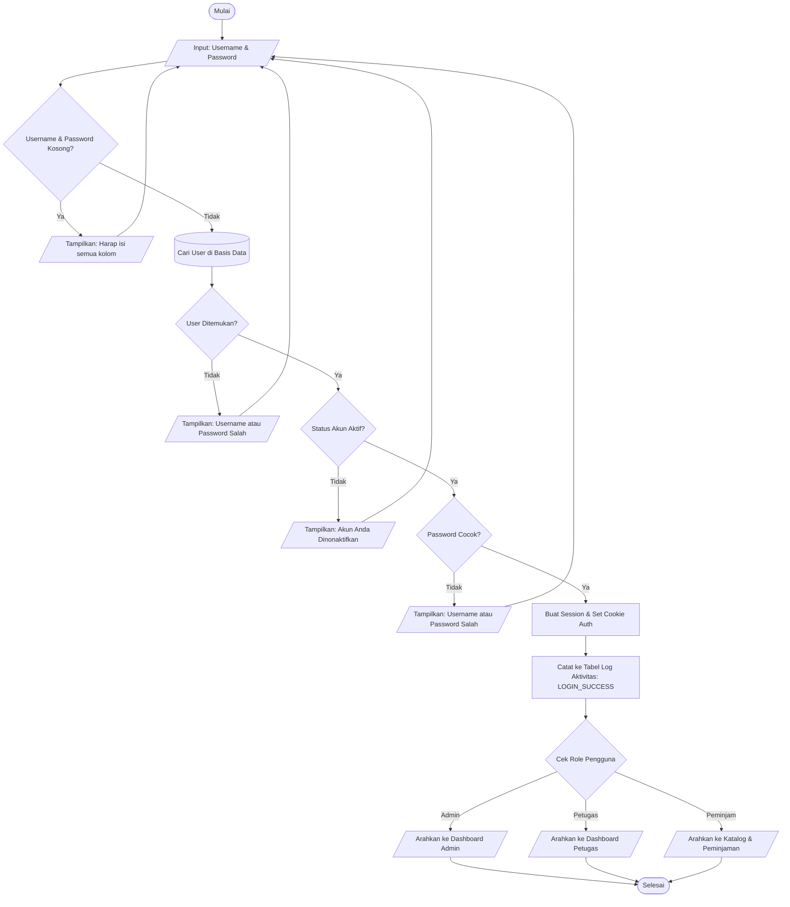
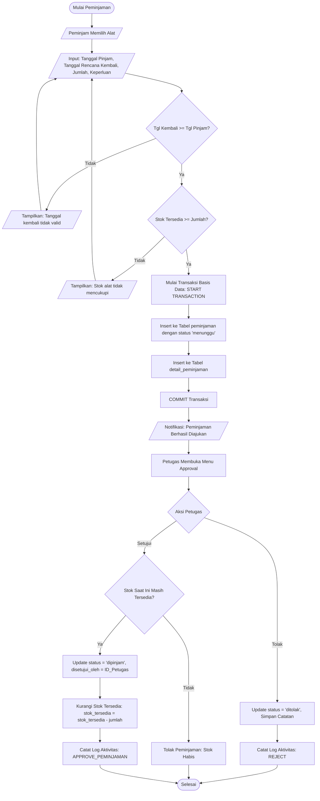
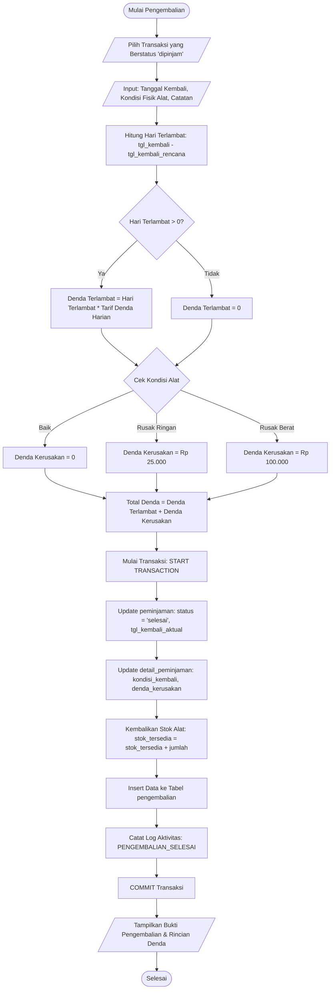

# FLOWCHART DAN PSEUDOCODE SISTEM PEMINJAMAN ALAT
**Uji Kompetensi Keahlian (UKK) Rekayasa Perangkat Lunak 2025/2026**
**Kode Soal:** KM25.4.1.1
**Judul Tugas:** Pengembangan Aplikasi Peminjaman Alat

---

## 1. Modul Autentikasi & Login Pengguna

### A. Flowchart Alur Login


### B. Pseudocode Proses Login
```text
ALGORITMA ProsesLogin
DEKLARASI:
    input_username, input_password : STRING
    user_record : RECORD OF User
    password_valid : BOOLEAN
    user_token : STRING

DESKRIPSI:
    BACA (input_username, input_password)
    
    JIKA input_username = "" ATAU input_password = "" MAKA
        TAMPILKAN "Error: Username dan Password wajib diisi!"
        SELESAI
    AKHIR JIKA

    // Cari pengguna pada basis data
    user_record <- CARI_USER_BY_USERNAME(input_username)

    JIKA user_record TIDAK ADA MAKA
        TAMPILKAN "Error: Kredensial tidak valid!"
        CATAT_LOG(NULL, "LOGIN_FAILED", "Percobaan login dengan username tidak dikenal: " + input_username)
        SELESAI
    AKHIR JIKA

    JIKA user_record.status != "aktif" MAKA
        TAMPILKAN "Error: Akun Anda sedang dinonaktifkan. Hubungi Admin!"
        SELESAI
    AKHIR JIKA

    password_valid <- VERIFIKASI_PASSWORD(input_password, user_record.password)

    JIKA password_valid = BENAR MAKA
        user_token <- GENERATE_AUTH_SESSION(user_record.id, user_record.role)
        CATAT_LOG(user_record.id, "LOGIN_SUCCESS", "Pengguna berhasil login sebagai " + user_record.role)
        
        JIKA user_record.role = "admin" MAKA
            REDIRECT("/admin/dashboard")
        LAIN JIKA user_record.role = "petugas" MAKA
            REDIRECT("/petugas/dashboard")
        LAIN
            REDIRECT("/peminjam/katalog")
        AKHIR JIKA
    LAIN
        CATAT_LOG(user_record.id, "LOGIN_FAILED", "Gagal login: Kata sandi salah")
        TAMPILKAN "Error: Kredensial tidak valid!"
    AKHIR JIKA
SELESAI
```

---

## 2. Modul Pengajuan & Persetujuan Peminjaman Alat

### A. Flowchart Alur Peminjaman Alat


### B. Pseudocode Pengajuan & Persetujuan Peminjaman
```text
ALGORITMA PengajuanPeminjaman
DEKLARASI:
    p_user_id, p_alat_id, p_jumlah : INTEGER
    p_tgl_pinjam, p_tgl_kembali : DATE
    p_keperluan : STRING
    alat_data : RECORD OF Alat
    kode_pinjam : STRING

DESKRIPSI:
    BACA (p_user_id, p_alat_id, p_jumlah, p_tgl_pinjam, p_tgl_kembali, p_keperluan)

    JIKA p_tgl_kembali < p_tgl_pinjam MAKA
        RETURN HASIL("Tanggal rencana kembali tidak boleh sebelum tanggal pinjam", 400)
    AKHIR JIKA

    alat_data <- CARI_ALAT_BY_ID(p_alat_id)
    JIKA alat_data TIDAK ADA MAKA
        RETURN HASIL("Alat tidak ditemukan", 404)
    AKHIR JIKA

    JIKA alat_data.stok_tersedia < p_jumlah MAKA
        RETURN HASIL("Jumlah pinjam melebihi stok yang tersedia saat ini", 400)
    AKHIR JIKA

    START TRANSACTION
        kode_pinjam <- "PINJAM-" + CURRENT_TIMESTAMP() + "-" + RANDOM_INT(100, 999)
        pinjam_id <- INSERT_PEMINJAMAN(kode_pinjam, p_user_id, p_tgl_pinjam, p_tgl_kembali, "menunggu", p_keperluan)
        INSERT_DETAIL_PEMINJAMAN(pinjam_id, p_alat_id, p_jumlah, "baik")
        CATAT_LOG(p_user_id, "AJUKAN_PINJAM", "Mengajukan pinjam " + kode_pinjam)
    COMMIT

    RETURN HASIL("Peminjaman berhasil diajukan dan menunggu persetujuan", 200)
SELESAI

ALGORITMA PersetujuanPeminjaman (Oleh Petugas / Admin)
DEKLARASI:
    p_pinjam_id, p_petugas_id : INTEGER
    p_status_aksi : STRING // "disetujui" atau "ditolak"
    p_catatan : STRING
    pinjam_data : RECORD OF Peminjaman
    detail_data : RECORD OF DetailPeminjaman
    alat_data : RECORD OF Alat

DESKRIPSI:
    BACA (p_pinjam_id, p_petugas_id, p_status_aksi, p_catatan)

    pinjam_data <- CARI_PEMINJAMAN_BY_ID(p_pinjam_id)
    detail_data <- CARI_DETAIL_BY_PINJAM_ID(p_pinjam_id)
    alat_data   <- CARI_ALAT_BY_ID(detail_data.alat_id)

    JIKA p_status_aksi = "disetujui" MAKA
        JIKA alat_data.stok_tersedia < detail_data.jumlah MAKA
            RETURN HASIL("Gagal: Stok fisik alat sudah habis terpinjam", 400)
        AKHIR JIKA

        START TRANSACTION
            UPDATE_STATUS_PEMINJAMAN(p_pinjam_id, "dipinjam", p_petugas_id, p_catatan)
            UPDATE_STOK_ALAT(detail_data.alat_id, alat_data.stok_tersedia - detail_data.jumlah)
            CATAT_LOG(p_petugas_id, "APPROVE_PINJAM", "Menyetujui peminjaman " + pinjam_data.kode_pinjam)
        COMMIT
        RETURN HASIL("Peminjaman berhasil disetujui", 200)
    LAIN
        START TRANSACTION
            UPDATE_STATUS_PEMINJAMAN(p_pinjam_id, "ditolak", p_petugas_id, p_catatan)
            CATAT_LOG(p_petugas_id, "REJECT_PINJAM", "Menolak peminjaman " + pinjam_data.kode_pinjam + ": " + p_catatan)
        COMMIT
        RETURN HASIL("Peminjaman telah ditolak", 200)
    AKHIR JIKA
SELESAI
```

---

## 3. Modul Pengembalian Alat & Kalkulasi Denda

### A. Flowchart Alur Pengembalian Alat & Denda


### B. Pseudocode Perhitungan Denda & Pengembalian
```text
ALGORITMA ProsesPengembalianAlat
DEKLARASI:
    p_pinjam_id, p_petugas_id : INTEGER
    p_tgl_kembali : DATE
    p_kondisi_kembali : STRING  // 'baik', 'rusak_ringan', 'rusak_berat'
    p_catatan : STRING

    pinjam_rec : RECORD OF Peminjaman
    detail_rec : RECORD OF DetailPeminjaman
    alat_rec   : RECORD OF Alat

    hari_terlambat : INTEGER
    tarif_harian   : DECIMAL
    denda_telat    : DECIMAL
    denda_kerusakan: DECIMAL
    total_denda    : DECIMAL
    status_bayar   : STRING
    kode_kembali   : STRING

DESKRIPSI:
    BACA (p_pinjam_id, p_petugas_id, p_tgl_kembali, p_kondisi_kembali, p_catatan)

    pinjam_rec <- CARI_PEMINJAMAN_BY_ID(p_pinjam_id)
    detail_rec <- CARI_DETAIL_BY_PINJAM_ID(p_pinjam_id)
    alat_rec   <- CARI_ALAT_BY_ID(detail_rec.alat_id)

    JIKA pinjam_rec.status != "dipinjam" DAN pinjam_rec.status != "disetujui" MAKA
        RETURN HASIL("Status peminjaman tidak valid untuk dikembalikan", 400)
    AKHIR JIKA

    // 1. Perhitungan Keterlambatan
    hari_terlambat <- HITUNG_SELISIH_HARI(p_tgl_kembali, pinjam_rec.tanggal_kembali_rencana)
    JIKA hari_terlambat < 0 MAKA
        hari_terlambat <- 0
    AKHIR JIKA

    tarif_harian <- alat_rec.tarif_denda_harian
    denda_telat  <- hari_terlambat * tarif_harian

    // 2. Perhitungan Denda Kerusakan Fisik
    JIKA p_kondisi_kembali = "rusak_ringan" MAKA
        denda_kerusakan <- 25000.00
    LAIN JIKA p_kondisi_kembali = "rusak_berat" MAKA
        denda_kerusakan <- 100000.00
    LAIN
        denda_kerusakan <- 0.00
    AKHIR JIKA

    // 3. Total Denda
    total_denda <- denda_telat + denda_kerusakan

    JIKA total_denda > 0 MAKA
        status_bayar <- "belum_lunas"
    LAIN
        status_bayar <- "tidak_ada_denda"
    AKHIR JIKA

    // 4. Eksekusi Transaksi Database (ACID)
    START TRANSACTION
        kode_kembali <- "KMB-" + CURRENT_TIMESTAMP() + "-" + RANDOM_INT(100, 999)

        // Update status peminjaman
        UPDATE_PEMINJAMAN_STATUS(p_pinjam_id, "selesai", p_tgl_kembali)

        // Update detail pengembalian
        UPDATE_DETAIL_KEMBALI(detail_rec.id, p_kondisi_kembali, denda_kerusakan)

        // Pulihkan stok alat kembali ke gudang
        UPDATE_STOK_ALAT(alat_rec.id, alat_rec.stok_tersedia + detail_rec.jumlah)

        // Simpan data pengembalian resmi
        INSERT_PENGEMBALIAN(
            kode_kembali, p_pinjam_id, pinjam_rec.user_id, p_petugas_id,
            p_tgl_kembali, hari_terlambat, denda_telat, denda_kerusakan,
            total_denda, status_bayar, p_catatan
        )

        // Catat Audit Trail
        CATAT_LOG(p_petugas_id, "PENGEMBALIAN", 
                  "Pengembalian " + pinjam_rec.kode_pinjam + " diproses. Total Denda: Rp " + total_denda)
    COMMIT

    RETURN HASIL_BERSIH(kode_kembali, total_denda, hari_terlambat, status_bayar)
SELESAI
```
